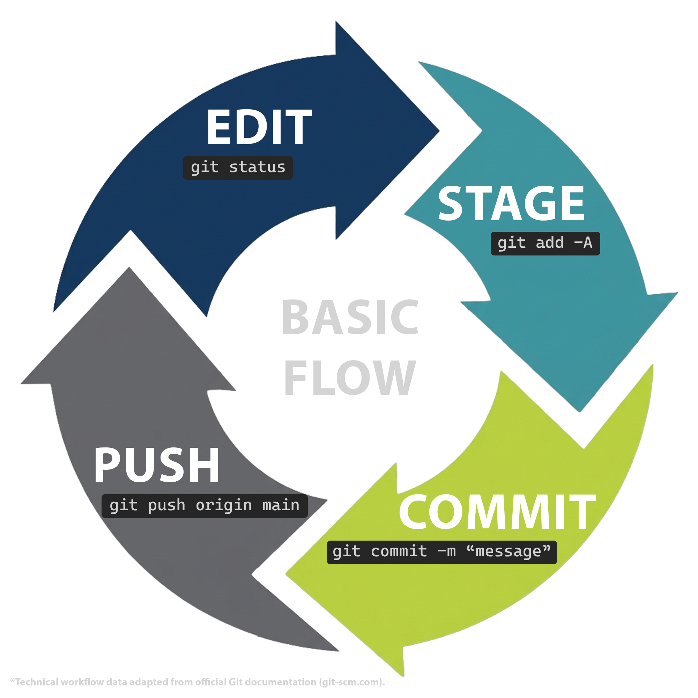

import { Aside } from "@astrojs/starlight/components";

## The save cycle



- **Edit**: You make changes to your files just like you normally would, such as writing a paragraph, fixing a typo, or saving a document.
- **Stage**: You pick which specific changes you want to include in your next official snapshot. Think of this like placing items into a packing box before taping it shut.
- **Commit**: You officially save the snapshot directly to your local computer's history log.
- **Push**: You send your newly saved local snapshots up to your account on the GitHub website so your online backup is completely up to date.

<Aside title="Technical Note">
    This cyclical workflow maps directly to the data management protocols
    outlined in the Official Git Documentation, ensuring that your local
    timeline remains structurally sound before interacting with cloud servers.
</Aside>

## Making your first commit

To save your very first snapshot, make a small change to a file inside your new folder (like adding a line of text to a practice file). Next, open your command line, navigate into your new project folder using the steps outlined on the [Command line primer](command-line-primer) page, and tell Git to gather up your changed files.

Type this command and press **Enter**:

```bash
$ git add <your-file-name>
```

<Aside title="Note">
Do not type the $ symbol at the beginning. Replace _\<your-file-name>_ with the actual name of the file you want to save, such as `draft.txt`.
</Aside>

<Aside type="tip" title="Expected response">
    The command line will move down to a clean prompt line without showing a
    message. This silence means Git successfully placed your file into the
    packing box.
</Aside>

Next, you will lock those changes into your timeline by adding a short, plain-English message explaining what changed.

Type this command and press **Enter**:

```bash
$ git commit -m "<your-custom-message>"
```

<Aside title="Note">
Do not type the $ symbol at the beginning. Replace _\<your-custom-message>_ with a quick description of your work inside the quotation marks, like `git commit -m "added introduction section"`.
</Aside>

<Aside type="tip" title="Expected response">
The computer will output a summary showing your saved snapshot, looking similar to this:

```text
> [main c1a2b3c] added introduction section
> 1 file changed, 1 insertion(+)
```

</Aside>

## Uploading your changes

Right now, your saved snapshot only exists on your physical computer. To send your work up to your online backup on the GitHub website so it is safe and shareable, we'll use the push command.

Type this command and press **Enter**:

```bash
$ git push origin main
```

<Aside title="Note">
    Do not type the $ symbol at the beginning. If the command line asks you for
    your password after typing this, remember to paste the **Personal Access
    Token** you saved earlier, rather than your regular website password.
</Aside>

<Aside type="tip" title="Expected response">
The command line will display several lines detailing the upload process, ending with confirmation that it successfully talked to GitHub:

```text
> To https://github.com/your-username/my-first-project.git
>
> - [new branch] main -> main
```

</Aside>

Once the command finishes running, refresh your project page on the GitHub website. You will see your files and your custom commit message sitting safely online.

### Congratulations!

You have successfully saved your first official project snapshot.

## Checking your tracking status

Because the command line does not have a visual interface, it can be easy to lose track of where your files are in the save cycle. If you ever want to check what Git is thinking, you can ask it for a status update.

Type this command and press **Enter**:

```bash
$ git status
```

<Aside title="Note">Do not type the $ symbol at the beginning.</Aside>

This command acts like a diagnostic scan. Git will print out a brief status report back to you.

<Aside type="tip" title="Expected response (Unstaged File)">
If you modified a file but haven't run the add command yet, Git will display the file name in red text under a heading that says "Changes not staged for commit":

```text
Changes not staged for commit:
> (use "git add <file>..." to update what will be committed)
> modified: draft.txt
```

</Aside>

<Aside type="tip" title="Expected response (Staged File)">
Once you run the add command, Git shifts that file name to green text under a heading that says "Changes to be committed." If you see green text, your packing box is successfully filled and you are ready to use the commit command!

```text
> Changes to be committed:
> (use "git restore --staged <file>..." to unstage)
> modified: draft.txt
```

</Aside>
