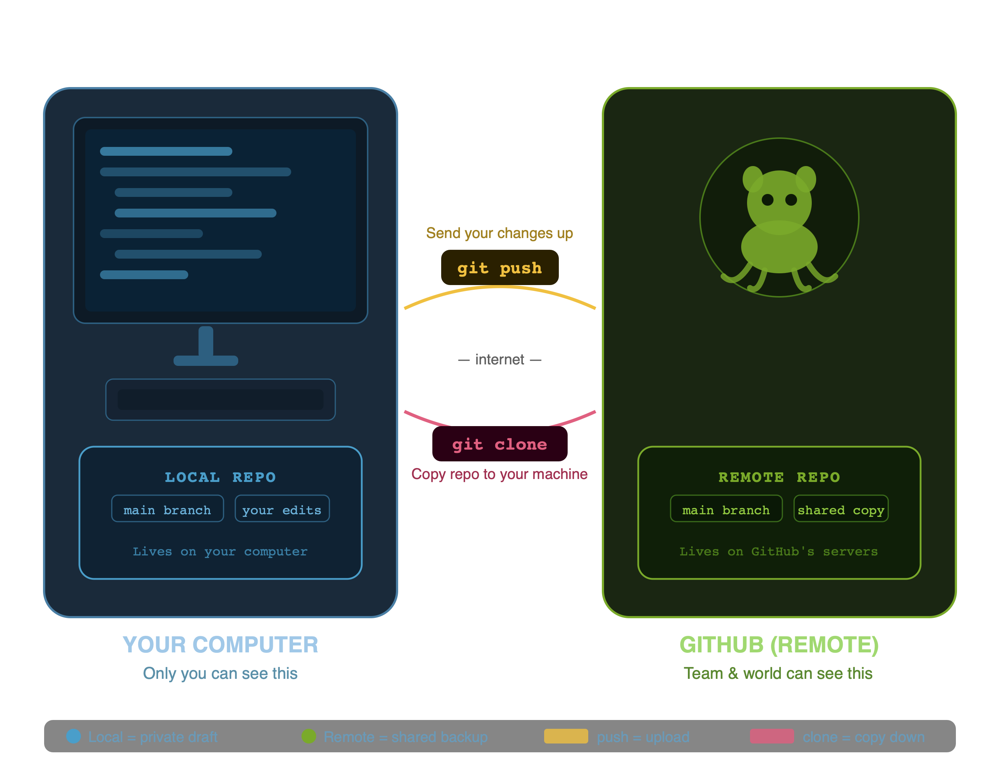

import { Aside } from "@astrojs/starlight/components";

## Git vs. GitHub

Before we dive into how to use these tools, we need to clear up a common point of confusion. While they sound almost identical, Git and GitHub are two completely separate things that work together:

- Git is the local tool that lives directly on your computer. It is the actual engine that acts like your project's personal time machine, recording changes to your files behind the scenes.
- GitHub is an online website where you store copies of your project folders. Think of it as a cloud backup space designed specifically to let you save your work online, share your project folders with others, or collaborate on a shared project.

_Note: While your online backup can be shared via a web link, this guide focuses entirely on managing your individual project timeline._

## Understanding the staging area

When you modify files in a project folder, Git notices your changes immediately, but it does not save them right away. Instead, Git uses an intermediate step called the staging area.
Think of your local project folder like a physical room where you are packing up items to mail to a friend.

- Modifying a file is like pulling an item off your shelf and laying it on the table.
- Staging a file (using the add command) is like picking up that item and placing it neatly inside your cardboard packing box.
- Committing (using the commit command) is the exact physical act of taping the box shut, labeling it, and placing it on your front porch.

By having a staging area, you have complete control over your history log. If you edit five different files but only want to save two of them into your next official snapshot, you simply place those specific two files into your "box" and leave the rest on the table for later.

<Aside type="tip" title="Why the staging area matters">
    Visualizing the staging area as an intermediate container helps prevent
    accidental file tracking. Industry training methodologies from the
    [Atlassian Git
    Guides](https://www.atlassian.com/git/tutorials/saving-changes) emphasize
    that mastering this separation is the foundation of clean project history.
</Aside>
